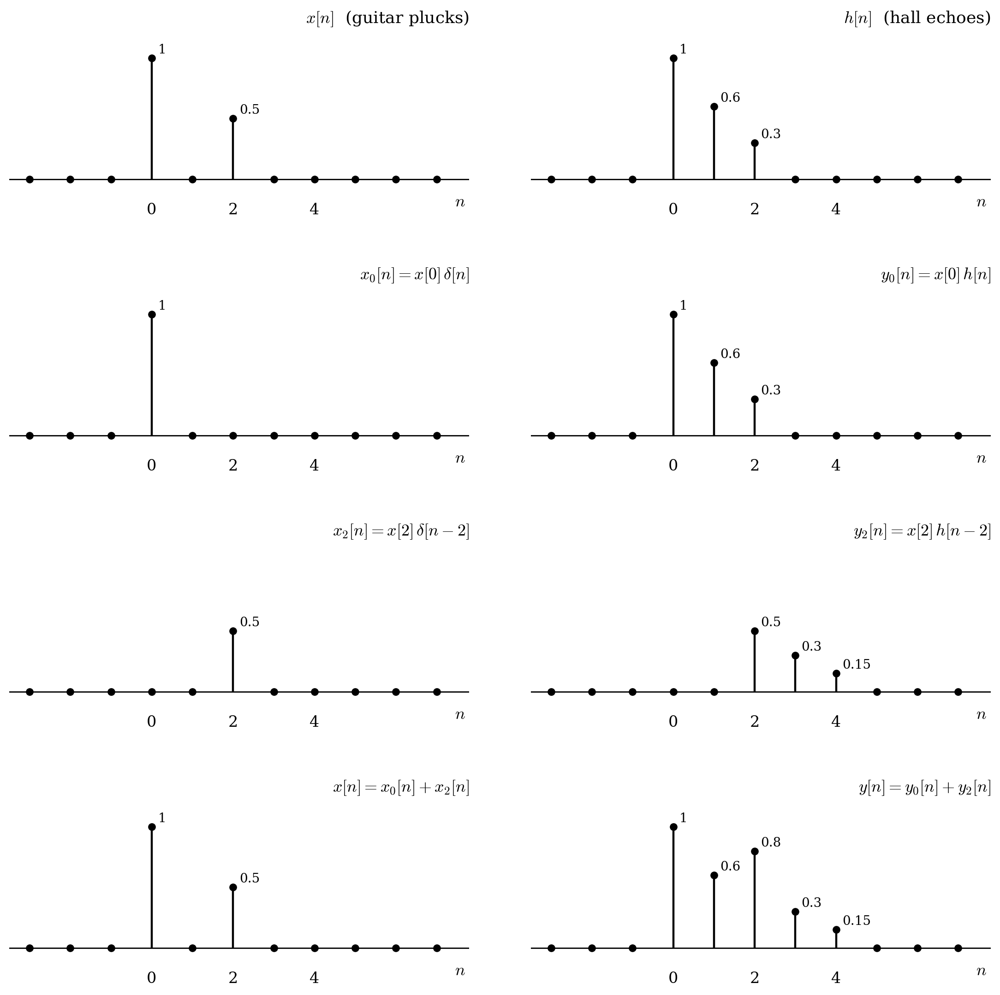

# Lecture 1

## Convolution

### Different from Multiplication

$$
x[n-b]h[n-b] = y[n-b]
$$

but:

$$
x[n-b]*h[n-b] = y[n-2b]
$$

Example:

River gauge downstream of a watershed.

- `x[n]` = rainfall on day n (the input)
- `h[n]` = the watershed's impulse response — how much water passes the
  gauge n days after one unit of rain falls. Its index is *elapsed time
  since the rain*, not a calendar day.
- `y[n] = x[n] * h[n]` = the flow you measure at the gauge

Convolution is exactly right here: each day's rain spreads out over the
following days, and the total flow on any day is the sum of contributions
from all the earlier storms. The system is causal — `h[n] = 0` for `n < 0`,
since no water reaches the gauge before the rain falls — so `y[n]` depends
only on rain that has already happened.

x[n−7] — the same storm, but it arrives 7 days later. Rain late →
flood late. Pushes the output 7 days later.

h[n+5] — the watershed now routes water 5 days faster: say the marsh
was drained and channelized, so runoff reaches the gauge sooner. Faster
system → flood sooner. Pulls the output 5 days earlier.

Net effect: 7 late − 5 early = 2 days late. That's `y[n−2]`.

## Convolution sum

$$
y[n] = x[n] * h[n] = \sum_{k=-\infty}^{\infty} x[k]h[n-k] = \sum_{k=-\infty}^{\infty} h[k]x[n-k]
$$

### Example

The input x[n] is the guitarist's plucks: a strong pluck at n = 0, silence at n = 1, and a softer pluck at n = 2.

$$
x[n] = \{\underset{\uparrow}{1},\ 0,\ 0.5\}
$$

The impulse response h[n] is the hall's echoes: direct sound (1), an early wall reflection (0.6), and a fainter late reflection (0.3).

$$
h[n] = \{\underset{\uparrow}{1},\ 0.6,\ 0.3\}
$$

Convolution sum:

$$
\begin{aligned}
y[0] &= x[0]h[0] = (1)(1) = 1 \\
y[1] &= x[0]h[1] + x[1]h[0] = (1)(0.6) + (0)(1) = 0.6 \\
y[2] &= x[0]h[2] + x[1]h[1] + x[2]h[0] = 0.3 + 0 + 0.5 = 0.8 \\
y[3] &= x[1]h[2] + x[2]h[1] = 0 + (0.5)(0.6) = 0.3 \\
y[4] &= x[2]h[2] = (0.5)(0.3) = 0.15
\end{aligned}
$$

[Interactive demo](https://htmlpreview.github.io/?https://github.com/ClaudeHu/EC516DSP/blob/main/interactive/guitar_hall_convolution_stepper.html)

### Properties

**Commutative**

$$
x[n] * h[n] = h[n] * x[n]
$$

Example: It doesn't matter whether you treat the plucks as the input to the hall or the hall's echo pattern as the input "played" by the plucks. Checking one sample with the swapped order gives y[2] = [...]

**Associative**

$$
\big(x[n] * h_1[n]\big) * h_2[n] = x[n] * \big(h_1[n] * h_2[n]\big)
$$

Example: A kerb impact x[n] passes through the tyre h1[n] = {0.8, 0.2}, then the suspension h2[n] = {0.5, 0.3}, before reaching the chassis. You can simulate the two stages one after the other, or [...]

**Distributive**

$$
x[n] * h[n] = x[n] * \big(h_1[n] + h_2[n]\big) = x[n] * h_1[n] + x[n] * h_2[n]
$$

Example: You record with two microphones, a close mic that hears only the direct sound, h₁ = {1}, and a room mic that hears only the reflections, h₂ = {0, 0.6, 0.3}. The close mic gives {1, 0, 0.5[...]

## Frequency Domain

$$
x[n] = e^{j\omega n}
$$

$$
y[n] = \sum_{k=-\infty}^{\infty} h[k] e^{j\omega (n-k)}
     = e^{j\omega n} \underbrace{\sum_{k=-\infty}^{\infty} h[k] e^{-j\omega k}}_{H(e^{j\omega})}
$$

$$
y[n] = H(e^{j\omega}) e^{j\omega n}
$$

$$
H(e^{j\omega}) = \sum_{k=-\infty}^{\infty} h[k] e^{-j\omega k}
$$

$e^{j\omega n}$ is an eigenfunction of the system, and the associated eigenvalue is $H(e^{j\omega})$

**eigen**

A matrix $A$ usually changes both the length and the direction of a vector. A few special vectors only get stretched, and their direction stays the same:

$$
A\mathbf{v} = \lambda\mathbf{v}
$$

Here $\mathbf{v}$ is an eigenvector and the number $\lambda$ is its eigenvalue. "Eigen" is German for "own" or "characteristic": these are the system's own special inputs.

**eigen in LTI system**:

$$
y[n] = \underbrace{\mathcal{H}}_{A}\big\lbrace\underbrace{e^{j\omega n}}_{\mathbf{v}}\big\rbrace = \underbrace{H(e^{j\omega})}_{\lambda}\underbrace{e^{j\omega n}}_{\mathbf{v}}
$$

$A$ → the system itself, $\mathcal{H}$. In linear algebra, $A$ is the operation that transforms a vector.

**example**

$x[n] = e^{j\omega n}$ - the note as input, a steady spin at one frequency $\omega$ (pitch)

h[n] - impulse response
* h[0]: the direct sound hitting the mic
* h[3]: a reflection off the back wall arriving 3 samples later, somewhat quieter
* h[40]: a faint bounce off the ceiling, and so on

$y[n] = \sum_{k=-\infty}^{\infty} h[k] e^{j\omega (n-k)}$
* $e^{j\omega (n-k)}$ - the note as it was k samples ago,
