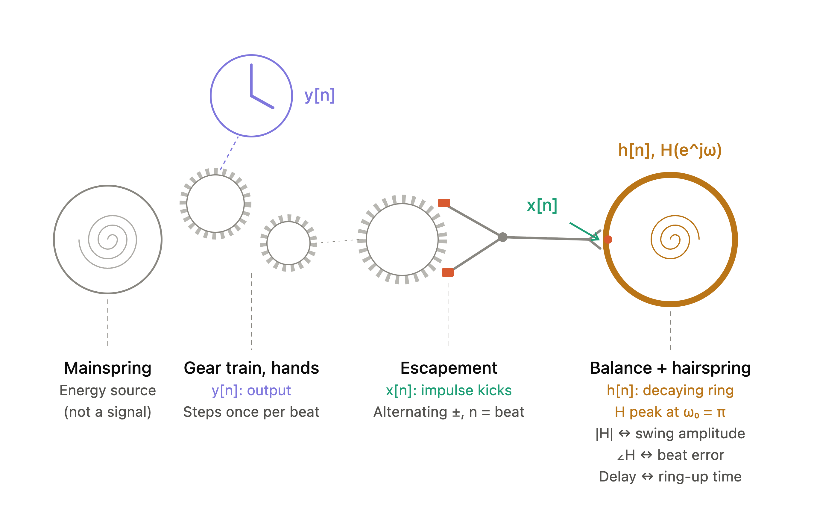

# Lecture 2

## Frequency Domain

$$
e^{j\omega_0 n} = cos(\omega_0 n) + j sin(\omega_0 n)
$$
$$
cos(\omega_0 n) = \frac{1}{2}e^{j\omega_0 n} + \frac{1}{2}e^{-j\omega_0 n}
$$
$$
sin(\omega_0 n) = \frac{j}{2}e^{-j\omega_0 n} - \frac{j}{2}e^{j\omega_0 n}
$$

### Gain & Delay

$$
Frequency\ Response:\ H(e^{j\omega}) = |H(e^{j\omega})| e^{j\angle H(e^{j\omega}}
$$
$$
Gain = Magnitude = |H(e^{j\omega})|
$$
$$
y[n] = H(e^{j\omega}) e^{j\omega n} = |H(e^{j\omega})| e^{j\angle H(e^{j\omega})}  e^{j\omega n} = |H(e^{j\omega})| e^{j\omega n + j\angle H(e^{j\omega})} = \underbrace{|H(e^{j\omega})|}_{gain} e^{j\omega (n - \underbrace{\frac{\angle H(e^{j\omega})}{\omega})}_{delay}} 
$$

**Example**

$$x[n]$$: impulses the pallet fork delivers to the balance, 8 per second at 28,800 vph (4 Hz oscillation because each full back-and-forth cycle takes two beats)

$$h[n]$$: Give the balance one flick and let go. It rings as a decaying sinusoid at its natural frequency (e.g. 4 Hz), set by the hairspring stiffness and the balance's inertia. The decay rate is set by friction and air drag, which is the oscillator's Q (roughly 200–300 in a good watch).

* Q: quality factor, describes how "good" a tuned circuit was. Q = 2π × (energy stored) ÷ (energy lost per cycle)
