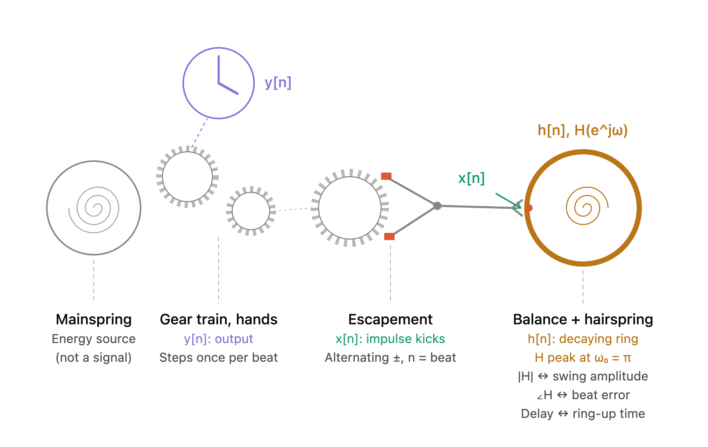
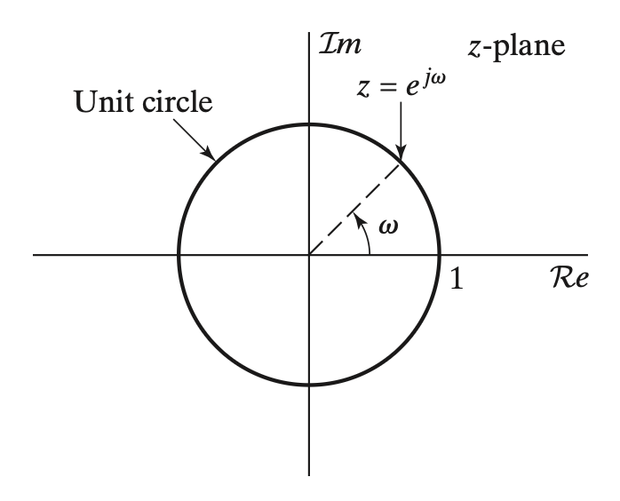
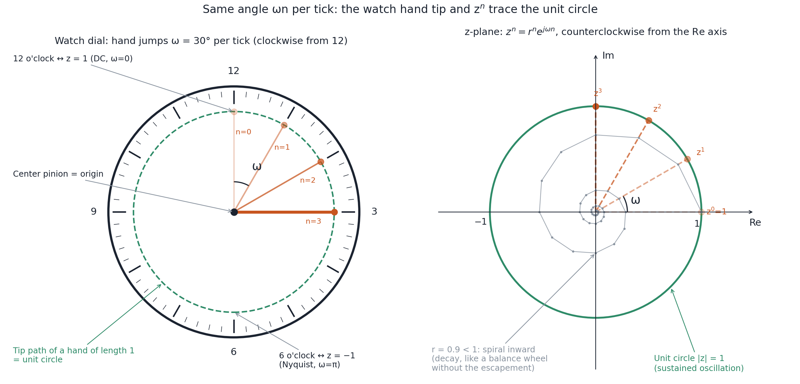

# Lecture 2

## Sinusoid

$$
e^{j\omega_0 n} = cos(\omega_0 n) + j sin(\omega_0 n)
$$
$$
cos(\omega_0 n) = \frac{1}{2}e^{j\omega_0 n} + \frac{1}{2}e^{-j\omega_0 n}
$$
$$
sin(\omega_0 n) = \frac{j}{2}e^{-j\omega_0 n} - \frac{j}{2}e^{j\omega_0 n}
$$

### Sinusoidal Response of LTI Systems (Textbook Example 2.15)

Let input $x[n] = A cos(\omega_0n + \phi) = \frac{A}{2} e^{j\phi}e^{j\omega_0 n} + \frac{A}{2} e^{-j\phi}e^{-j\omega_0 n}$

let $x_1[n] = \frac{A}{2} e^{j\phi}e^{j\omega_0 n}$, $x_2[n] = \frac{A}{2} e^{-j\phi}e^{-j\omega_0 n}$

Then $y_1[n] = H(e^{j\omega_0})x_1[n]$, $y_2[n] = H(e^{-j\omega_0})x_2[n]$

* $x[n] = \sum_{k}\alpha_k e^{j\omega_kn}$
* $y[n] = \sum_{k}\alpha_k H(e^{j \omega_k})e^{j\omega_kn}$

**Magnitude and Phase**

When a stable sinusoidal signal passes through an LTI system, the system modifies its magnitude by multiplying it by $|H(e^{j\omega_0})|$, and shifts its phase by adding $arg[H(e^{j\omega_0})]$

## Gain & Delay

$$
Frequency\ Response:\ H(e^{j\omega}) = |H(e^{j\omega})| e^{j\angle H(e^{j\omega}}
$$
$$
Gain = Magnitude = |H(e^{j\omega})|
$$
$$
y[n] = H(e^{j\omega}) e^{j\omega n}
= |H(e^{j\omega})| e^{j\angle H(e^{j\omega})} e^{j\omega n}
= |H(e^{j\omega})| e^{j\omega n + j\angle H(e^{j\omega})}
= \underbrace{|H(e^{j\omega})|}_{\text{gain}} e^{j\omega \left(n - \underbrace{\frac{-\angle H(e^{j\omega})}{\omega}}_{\text{delay}}\right)}
$$

**Example**

$$x[n]$$: impulses the pallet fork delivers to the balance, 8 per second at 28,800 vph (4 Hz oscillation because each full back-and-forth cycle takes two beats)

$$h[n]$$: Give the balance one flick and let go. It rings as a decaying sinusoid at its natural frequency (e.g. 4 Hz), set by the hairspring stiffness and the balance's inertia. The decay rate is set by friction and air drag, which is the oscillator's Q (roughly 200–300 in a good watch).

* Q: quality factor, describes how "good" a tuned circuit was. Q = 2π × (energy stored) ÷ (energy lost per cycle)

$\omega_0$: the location of the resonance peak.

$H(e^{j\omega})$: A very sharp resonance peak centred on the natural frequency. The high Q is what makes the watch a good timekeeper: it rejects disturbances away from its own frequency.

$|H(e^{j\omega})|$: The balance amplitude, the swing angle, typically about 270–310°. Near resonance, small kicks build up a large swing. Off-resonance inputs such as random wrist jolts are strongly attenuated.

$\frac{-\angle H(e^{j\omega})}{\omega}$: short lag in where in the cycle the balance is (phase delay)

**Trick to Remember**

$$
1 - e^{-j\omega} = e^{-\frac{j\omega}{2}} (e^{\frac{j\omega}{2}} - e^{-\frac{j\omega}{2}})
$$

## Fourier Transform

$$
H(e^{j\omega}) = \sum_{k=-\infty}^{\infty} h[k] e^{-j\omega k} = \text{Fourier Transform of h[n]}
$$

### Properties

**Periodicity**

$$X(e^{j(\omega + 2\pi)}) = X(e^{j\omega})$$

**Time Shifting**

$$x[n - n_0] \;\longleftrightarrow\; e^{-j\omega n_0}\, X(e^{j\omega})$$

**Frequency Shifting**

$$e^{j\omega_0 n}\, x[n] \;\longleftrightarrow\; X(e^{j(\omega - \omega_0)})$$

**Time Reversal**

$$x[-n] \;\longleftrightarrow\; X(e^{-j\omega})$$

**Linearity**

$$a\,x_1[n] + b\,x_2[n] \;\longleftrightarrow\; a\,X_1(e^{j\omega}) + b\,X_2(e^{j\omega})$$

**Convolution**

$$x[n] * h[n] = \sum_{k=-\infty}^{\infty} x[k]\,h[n-k] \;\longleftrightarrow\; X(e^{j\omega})\,H(e^{j\omega})$$

## z-transform

$$
\mathcal{X}(z) = \sum_{n=-\infty}^{\infty}x[n]z^{-n}
$$

**Example**

When you pluck a string, the sampled envelope decays roughly geometrically. Model it as $x[n] = a^n u[n]$

$z^{-1}$: delayed by one sample

polar: $z=re^{j\omega}$

* $r$: the radius, also is the growth or decay rate per sample.

### z-plane

z-transform asks: for every point on this plane, how much of that behavior is in the signal.
* $z=1\ (\omega=0)$: direct current, a constant signal.
*  $z=-1\ (\omega=\pi)$: the Nyquist frequency, where the signal flips sign every sample. This is the fastest a sampled signal can oscillate.

**Example**

[Interactive demo](https://htmlpreview.github.io/?https://github.com/ClaudeHu/EC516DSP/blob/main/interactive/watch_tick_z_plane.html)

A ticking seconds hand. It moves in discrete jumps (samples), and each tick rotates it by a fixed angle.

| z-plane concept | Watch equivalent |
|---|---|
| Origin | The center pinion the hands sit on |
| Unit circle | The path traced by the tip of a hand of length 1 |
| Point $z = e^{j\omega}$ | Where the hand tip sits after one tick |
| $n$ (sample index) | Tick count |
| $\omega$ (rad/sample) | Angle jumped per tick. A quartz-style tick is $6^\circ$, so $\omega = 2\pi/60$. |
| Smaller $\omega$ | A higher-beat movement. At 28,800 vph (8 beats/s) the hand advances only $2\pi/480$ per beat, so the sweep looks smooth. |
| $z = 1$ ($\omega = 0$) | A stopped hand: DC |
| $z = -1$ ($\omega = \pi$) | The hand jumps $180^\circ$ per tick. You can't tell which way it's turning, which is the Nyquist limit. |
| $2\pi$ periodicity / aliasing | If the hand jumped $354^\circ$ per tick, it would look like it was stepping backward $6^\circ$. This is the wagon-wheel effect, and it's exactly why frequencies above $\pi$ alias. |
| $r$ (radius) | The hand's length changing each tick |
